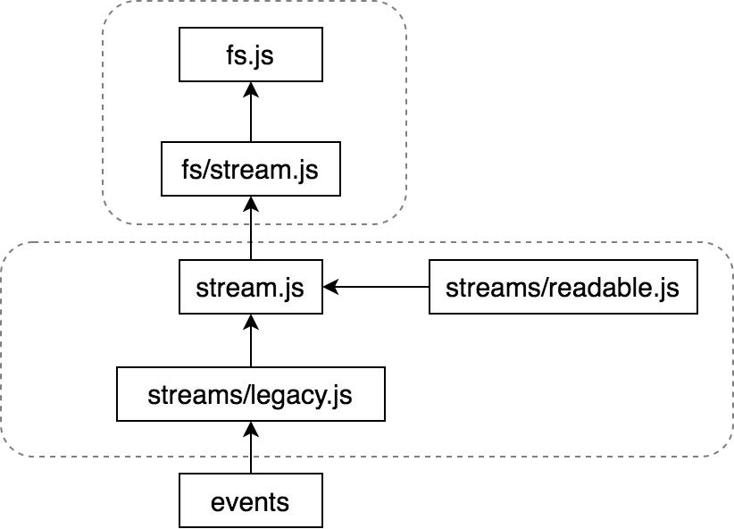

## Nodejs Stream pipe 的使用与实现原理分析 

[https://cloud.tencent.com/developer/article/1630068](https://cloud.tencent.com/developer/article/1630068)

### 不使用Stream：
```
const Koa = require('koa');
const fs = require('fs');
const app = new Koa();
const { promisify } = require('util');
const { resolve } = require('path');
const readFile = promisify(fs.readFile);

app.use(async ctx => {
  try {
    ctx.body = await readFile(resolve(__dirname, 'test.json'));
  } catch(err) { ctx.body = err };
});

app.listen(3000);
```

### 使用stream pipe
```
...
app.use(async ctx => {
  try {
    const readable = fs.createReadStream(resolve(__dirname, 'test.json'));
    ctx.body = readable;
  } catch(err) { ctx.body = err };
});
```

### 使用 Stream VS 不使用 Stream:
不使用 Stream 时，将数据一次性读入内存再进行的返回，当数据文件很大的时候也是对内存的一种消耗


## 源码结构



```
// fs.js
...
({ ReadStream, WriteStream } = require('internal/fs/streams'));
...
function createReadStream(path, options) {
  lazyLoadStreams();
  return new ReadStream(path, options);
}
```

```
// fs/streams.js
const { Readable, Writable } = require('stream');

function ReadStream(path, options) {
  if (!(this instanceof ReadStream))
    return new ReadStream(path, options);

  ...
  Readable.call(this, options);
  ...
}
ObjectSetPrototypeOf(ReadStream.prototype, Readable.prototype);
ObjectSetPrototypeOf(ReadStream, Readable);
```

```
// stream.js
const Stream = module.exports = require('internal/streams/legacy');

Stream.Readable = require('_stream_readable');
```

```
// streams/legacy.js
const EE = require('events');
function Stream(opts) {
  EE.call(this, opts);
}
ObjectSetPrototypeOf(Stream.prototype, EE.prototype);
ObjectSetPrototypeOf(Stream, EE);

Stream.prototype.pipe = function(dest, options) {
  ...
};
```

```
// streams/readable.js
Readable.prototype.pipe = function(dest, options) {
  const src = this;
  src.on('data', ondata);
  ...
};
```

## 源码分析

1、执行pipe `A.pipe(B)`, 在pipe方法中判断是否在读取中，如果没有，那么开始读取`resume`

2、`resume`中会执行`stream.read(0);`, 直接读取一个空字符强制开始读操作

3、在`read`方法中调用`fromList`从buffer去读取数据，然后触发`data`事件（data事件是执行pipe时注册的）

4、`data`事件的回调方法里，会将读取的数据写入到缓冲区，目标流消费缓冲区的内容。如果缓冲区已满（目标流的消费速度比可读流的读取速度慢），则停止读取，设置`drain`事件：`dest.on('drain', ondrain)`

5、缓冲区的数据消费完之后，触发`drain`事件的回调`ondrain`

6、回调`ondrain`里继续执行read，回到第二步，完成循环，直到读取到结尾

注意点：

- 使用`read(0)`触发读操作
- 缓冲区大小默认为16k，可以在新建流时进行修改
- 判断是否应该继续读取数据时，老版本代码使用了计数器，现在已经更新为标记位

```
// When the dest drains, it reduces the awaitDrain counter
		 
// on the source.  This would be more elegant with a .once()
        
// handler in flow(), but adding and removing repeatedly is
        
// too slow.
```

### 案例分析

shadowsocks： pipe + encry

## 新闻：
- `React v17.0` [https://reactjs.org/blog/2020/10/20/react-v17.html](https://reactjs.org/blog/2020/10/20/react-v17.html)
    - 没有新功能
    - 提供两种升级方式：全部升级（像以前一样） or 部分升级（某些组件仍然使用以前的版本）
    - 事件代理从`<html>`转换为渲染节点 `ReactDOM.render(<App />,  document.getElementById('root'))`
    - 打算在`react native0.65`中支持`react 17`，时间未定
- `Node.js 15 正式发布：加入新工具类，附带 npm 7，支持 QUIC 协议` [https://mp.weixin.qq.com/s?__biz=MzUxMzcxMzE5Ng==&mid=2247502708&idx=1&sn=c3e7be9da9eaac85cca0216fef0fc0c6](https://mp.weixin.qq.com/s?__biz=MzUxMzcxMzE5Ng==&mid=2247502708&idx=1&sn=c3e7be9da9eaac85cca0216fef0fc0c6)
    - v10版本将在2021年4月结束生命周期
    - v14将在下周升级到LTS（目前LTS是v12.19）
    - [release history](https://github.com/nodejs/release#release-schedule)
- `Electron 10.1.4 发布，跨平台桌面应用开发工具` [https://www.oschina.net/news/119342/electron-10-1-4-released](https://www.oschina.net/news/119342/electron-10-1-4-released)


## 推荐阅读：
- `成为最差开发者的10个建议` [https://cloud.tencent.com/developer/news/707868](https://cloud.tencent.com/developer/news/707868)  [原文链接](https://dev.to/dabit3/top-10-pieces-of-advice-for-becoming-the-worst-developer-possible-3kke)